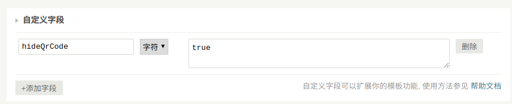

# typecho-qrcode
这是 Typecho 的文章二维码插件，它会自动为每篇文章生成一个二维码，可以直接用手机扫描，方便手机端查看。

实现
===========
这个插件的第一个版本是基于 [jeromeetienne/jquery-qrcode](https://github.com/jeromeetienne/jquery-qrcode) 实现的，由于 jquery-qrcode 依赖于 jquery，如果你的站点上其他插件也依赖 jquery，很可能会出现版本冲突的情况。所以重新写了第二个版本，这个版本基于 [davidshimjs/qrcodejs](https://github.com/davidshimjs/qrcodejs) 实现，它不依赖任何其他库。

使用方法
===========
1. [下载插件的最新版本](https://github.com/aneasystone/typecho-qrcode/releases) 并解压，将 QRCode 目录放到 Typecho 的插件目录 `/usr/plugins` 下；
1. 进入 Typecho 控制台 -- 插件管理，在 **禁用的插件** 列表中，应该会出现 QRCode 插件，启用该插件；
1. 在 **启动的插件** 列表中找到 QRCode 插件，点击 **设置** 按钮，可以设置二维码的尺寸等参数；
1. 访问你的任意一篇文章，如果一切设置 OK，在文章的最下面，评论的上方，应该可以看到为这篇文章自动生成的二维码；
1. 使用手机扫描二维码，检查是否可以在手机上访问这篇文章；

常见问题
===========

1. 这个插件和XXX插件同时使用时，就会冲突怎么办？

可能是老版本的 jquery 和你的插件冲突，请将 QRCode 插件升级到最新版本。如果还是存在冲突，欢迎给我提交 Issues。

2. 我有某些文章不想在尾部显示二维码，可以吗？

可以，你在编辑文章时，可以为文章添加自定义字段。如果不想该文章下方显示二维码，可以添加一个自定义字段 `hideQrCode`，值设置为 `true`。

如果有任何问题，欢迎给我提交 Issues 或 PR。
